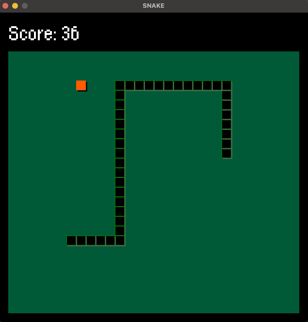

# SNAKE
## A retro classic written in C and SDL.

### Run the game

#### Dependencies
Ensure that SDL2, SDL2_Mixer and SDL2_TTF are installed.

#### Compile
<code>
clone https://github.com/jamescarr0/snake 
cd snake  
cmake -Bbuild/ 
cd build 
make 
</code>

##### Binary
./snake 

#### Play SNAKE!
<code>./snake</code>

#### Controls
Use arrow keys, up, down, left, and right to control the snake.
Press 'p' to pause and unpause the game.
